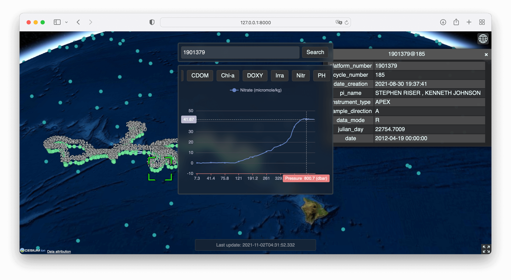

# ArgoBox²

A simple Argo data viewer. Both front-end, back-end and a handy data downloader & parser are included.

[ArgoBox²](https://github.com/richardhyy/argobox2) is an upgrade to [ArgoBox](https://github.com/richardhyy/ArgoBox).

*Final project for GISAppDev course (Fall 2021)*

## Screen Shots

## Setup

### Environment

* Python:
  * Execute `python -m pip install -r requirements.txt` to install all dependencies.
* Database:
  * PostgreSQL 12-14

### Database Migration
* Execute `manage.py migrate` in the project root to migrate the database.

### Argo Float Data
* Make sure ArgoBox² is functional before proceeding.
* Execute `python ./argo_importer/cron.py` manually to download and import Argo float data.
* Set up a cron job to run `python ./argo_importer/cron.py` every day.
