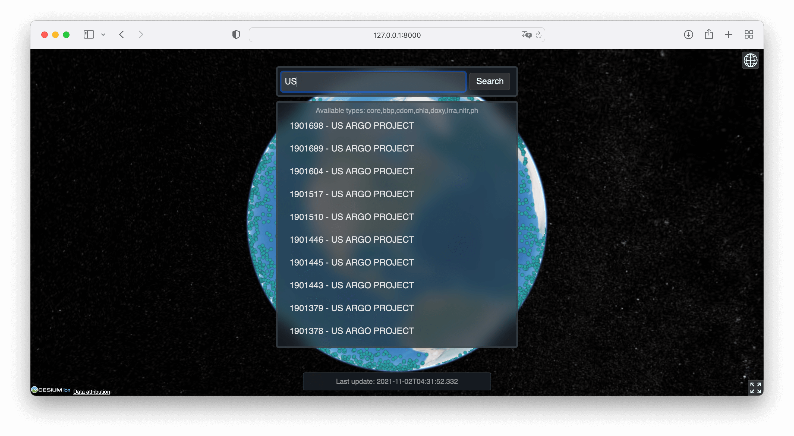

# ArgoBox²

A simple Argo data viewer. Both front-end, back-end and a handy data downloader & parser are included.

[ArgoBox²](https://github.com/richardhyy/argobox2) is an upgrade to [ArgoBox](https://github.com/richardhyy/ArgoBox).

*Final project for GISAppDev course (Fall 2021)*

## Screen Shots

